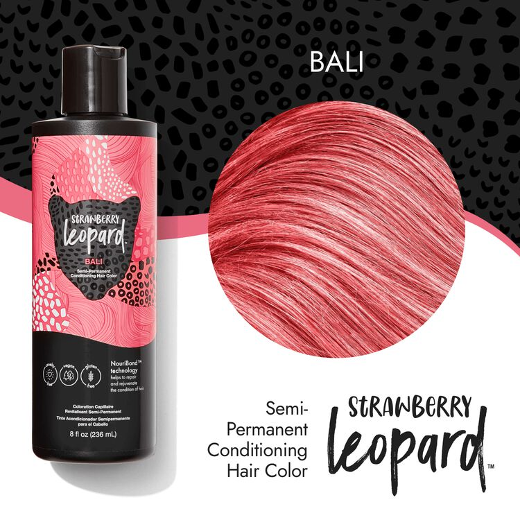

# How to Dye Your Hair At Home
Bad breakup? Mental breakdown? Going through a phase? We've all been there, and salons are EXPENSIVE! Dyeing your hair at home is fun, cost effective, and will only result in a botched makeover if done incorrectly. But let's try to avoid that, so here's how to do it right!
### _Warning: Bleach can cause chemical burns. Use gloves while working with bleach products and keep windows and doors open for ventilation!_

### Step 1: Gather your supplies!
The best place to get hair dyeing supplies is the Sally Beauty! There's one in Southside, so take the 81 or 83 bus to the last stop and you'll be dropped off in the parking lot! 
Here's what you're gonna need
- Gloves
- Bowl
- Brush
- Powder Bleach
- Developer
- Hair Dye Color of Your Choice!

##### Remember the cardinal rule of home hair dyeing: *Never* use box dye!
Instead, you'll want to use a conditioner based dye, like Manic Panic, Snow Leopard, or Good Dye Young. This will give you vibrant color without damaging your hair! Here's the color I use:

### Step 2: Part your hair!
If you part your hair using clips and hair ties, it will be much easier to complete the process, as you will know what you have worked on and what you have not.
For those with long hair, I suggest parting a section for the crown of your head, then two for the lower section of hair. Moving from the bottom up, ending with hair at the top of your head, will give you the best results.

### Step 3: Mix your bleach!
Put on the gloves and empty the powder bleach into the bowl. Adding the developer about a tablespoon at a time, mix them together with the brush until a foamy paste consistency is reached. 
Do not add so much developer that it becomes a liquid! The bleach will not stick evenly if it is liquidy.

### Step 4: Apply your bleach!
Bleach is heat activated, so any placed on or near your roots (closer to the scalp), will develop faster. Because we want a consistent color, start with the pieces furthest away from your scalp and move into the roots as you work. 

Use the brush to apply the bleach to your hair, parting layer by layer and spreading bleach on both sides of the hair follicle.

Once you've applied bleach to all of your hair, be sure to keep an eye on it as it develops. Letting it develop too long will be damaging to hair and skin, so when your hair reaches a consistent light blonde tone, you know you're ready for the next step.

### Step 5: Wash out the bleach!
This is very important, as you need to ensure you wash out all bleach for your hair's health.
Using cold water and some shampoo, wash out all the bleach. Have a friend double check that it's all out if you're not confident.

### Step 6: Dry your hair!
Not all dyes are made the same, but generally the hair follicles absorb color better when they're dry. To ensure an even and vibrant color, dry your hair before applying the dye.

### Step 7: Dye your hair!
This is the moment you've been waiting for! Wash the bowl and brush of any bleach, and use them again for the hair dye.
Because we are using a *CONDITIONER BASED* dye, it won't stain hands quite as much, so gloves are not necessary for this step. 
Parting your hair as you did for the bleach, use the brush to evenly distribute the dye to all parts of your hair. 

>*Pro Tip: To really make sure I've got everything completely covered in dye, I like to use my hands to spread dye throughout my hair after I've used the brush*

### Step 8: Wash out the dye!
Most dyes need to sit for 20-30 minutes for the pigment to stick, so at least wait this long before washing it out.

Because the dye is conditioner based, we don't need to use any shampoo or other products when washing the hair. Just rinse under cold water until the water runs clear and you can feel that all the dye has been removed from your hair.

### Step 9: Enjoy your new hair!
You've just completed your journey for beautiful, fun, vibrant hair! Experiment with colors, designs, anything that you want to do to express yourself!

